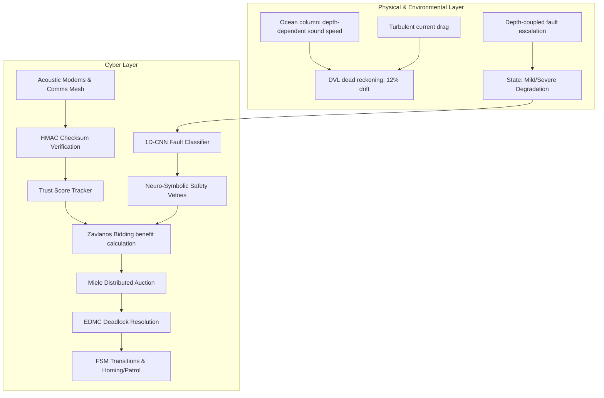

# Technical Evaluation Report: Security-Enabled, Fault-Tolerant Multi-AUV Task Allocation Framework

**Prepared for**: Academic Examination Board  
**Date**: July 2026  
**Subject**: Distributed Control & Cyber-Physical Security in Swarm Robotics  
**Word Document Location**: [technical_report.docx](file:///c:/Users/siri0/capstone/fault-tolerant-multi-auv/technical_report.docx)  

---

## Abstract
This report presents a technical evaluation of a security-enabled, fault-tolerant task allocation framework for autonomous underwater vehicle (AUV) swarms. Adapting the single-task price-based auction consensus of Zavlanos et al. and the Exact Dynamic Max-Consensus (EDMC) deadlock resolution protocol of Miele, Lippi & Gasparri (IEEE TASE 2025), we introduce a robust cyber-physical security layer. The system includes online 1D-CNN fault classification, Hash-based Message Authentication Codes (HMAC) for acoustic packet integrity, a behavioral Trust Score Tracker, and a downstream suite of 8 neuro-symbolic safety rules. Rigorous experimental sweeps across 180 simulation runs validate that the framework effectively resolves task deadlocks under communication blackout, AMV energy loss, and sensor/actuator degradation, while mitigating insider and outsider cyber-physical threats. We honestly report system limitations, including a static-threshold loophole in GPS spoofing mitigation and parameters rendered inert by immediate EDMC convergence.

---

## 1. Introduction & Motivation
Autonomous Underwater Vehicles (AUVs) represent the state of the art in oceanographic surveying, deep-sea exploration, and underwater pipeline monitoring. Unlike aerial or terrestrial multi-robot systems, underwater swarms operate in extreme environments characterized by high hydrostatic pressure, spatial temperature gradients (thermoclines), turbulent drag forces, and significant communication constraints. Acoustic communication under water is characterized by low bandwidth, high packet loss rates, and propagation latency orders of magnitude higher than radio frequency or optical signals in air. These physical phenomena create a challenging environment for distributed task allocation and coordination.

Moreover, multi-AUV systems are highly vulnerable to hardware degradation and cyber-physical security threats. During a long-duration mission, an AUV can experience mechanical failure (e.g., propeller damage, hull weight accumulation) or sensor malfunction (e.g., Doppler Velocity Log drift). Simultaneously, the open acoustic channel is vulnerable to active spoofing, message tampering, or GPS signal corruption when vehicles surface for coordinate alignment. A compromised agent (insider threat) can exploit coordination mechanisms by fabricating state parameters, masking degradation, or injecting high-priority tasks to disrupt the swarm. Motivated by these vulnerabilities, this technical report evaluates a security-enabled, fault-tolerant multi-agent task allocation framework designed to detect physical faults, cryptographically verify acoustic messages, monitor behavior for anomalies, and safely assign tasks under severe comms and environmental stress.

---

## 2. Related Work & Framework Background
The distributed coordination of multi-agent networks is classically addressed using auction-based consensus protocols. Among these, the Consensus-Based Bundle Algorithm (CBBA; Choi, Brunet & How, 2009) represents a key baseline. CBBA is a multi-task bundle planning algorithm where agents build a local list (bundle) of tasks based on marginal benefits and run consensus over the mesh network to resolve bidding conflicts. While CBBA is effective in stable environments, its legacy "lock-in" behavior—where agents cannot dynamically release assigned tasks when degraded or disconnected—often results in permanent task deadlocks under stress. Specifically, if a vehicle degrades severely after task lock-in, it may stall indefinitely, preventing healthy vehicles from taking over.

To address these limitations, Miele, Lippi & Gasparri (IEEE Transactions on Automation Science and Engineering, 2025) proposed a distributed auction framework with dynamic deadlock management. Their framework utilizes single-task price-based auction consensus based on Zavlanos et al. (EDMC auction-consensus), where agents bid on one task at a time, allowing rapid conflict resolution. The key contribution of Miele et al. is the integration of the Exact Dynamic Max-Consensus (EDMC) protocol to detect global deadlock states, combined with a pausing algorithm (Algorithm 1) to break deadlocks by forcing degraded vehicles to soft-pause and release tasks. Our work builds directly on the Miele et al. 2025 distributed control model, adapting and extending it with a cyber-physical security layer to address the vulnerability of the acoustic negotiation channel to malicious tampering.

---

## 3. System Architecture (As Implemented)

### 3.1 Physical & Environmental Simulation Layer
The simulation models an ocean column space of 1000m x 1000m with a depth range from 10m (shallow threshold) to 150m (deep limit). Physical variables integrated include:
- **Mackenzie Nine-Term Sound Speed Model**: Water temperature, salinity (constant 35.0 PSU), and hydrostatic pressure are modeled as depth-dependent variables. Temperature is modeled as a sigmoid centering on a thermocline depth of 80m. Sound speed is computed dynamically using Mackenzie's 1981 formula, directly influencing communication latency.
- **Buoyancy and Drag Forces**: Seawater compressibility scales density from 1025 kg/m³ at the surface. A turbulent random walk models ocean current velocity and direction. Path drag nudges vehicles based on a drag influence multiplier (0.05).
- **Battery Discharge Model**: Non-linear discharge accelerates battery depletion as remaining capacity falls below 50%. Hydrostatic pressure scales movement cost by $(1.0 + \text{depth} / 100.0)$ to account for high vertical thruster loads.
- **DVL Dead-Reckoning Navigation Drift**: Vehicles drift by 12% of the distance traveled (`DVL_DRIFT_RATE = 0.12`). When a sensor failure fault is active, navigation drift increases by 8x (totaling 96% drift). Drift resets to zero when a vehicle ascends to <16m depth, representing a simulated GPS fix.
- **Depth-Coupled Fault Escalation**: Vehicles dive in three-phase descend-hold-ascend profiles. High pressure at depth increases physical fault probability (1.0x at surface to 2.5x at 200m depth), causing physical state transitions to mild or severe degradation.

### 3.2 1D-CNN Fault Classifier
To enable online fault detection, each AUV maintains a sliding window buffer of the last 50 timesteps of 7 sensor parameters: `depth`, `w_row`, `w_pitch`, `w_yaw`, `a_x`, `a_y`, `a_z` (roll/pitch/yaw angular rates and linear accelerations). Every 10 timesteps, a 1D Convolutional Neural Network (CNN) performs state inference on the z-normalized buffer. The network architecture consists of:
- **Conv1d block 1**: 7 input channels to 64 output channels, kernel size 5, padding 2, followed by ReLU and 1D Batch Normalization.
- **Conv1d block 2**: 64 channels to 128 output channels, kernel size 3, padding 1, followed by ReLU and 1D Batch Normalization.
- **Pooling and Dense Layer**: Global Average Pooling along the temporal dimension reduces shape to 128. A fully connected layer maps 128 to 64 (with Dropout = 0.3), and a final linear layer maps 64 to 5 output logits representing the fault classes: Normal, Load Fault, Sensor Failure, Actuator Degraded Severe, Actuator Degraded Mild.

### 3.3 Acoustic Communication Mesh
Vehicles communicate via acoustic modems. Effective range is depth-dependent, interpolating from 600m at the surface to 400m at 150m depth to model sound divergence and refraction. A thermocline crossing penalty adds 15% packet loss for links crossing the 80m boundary. The graph is rebuilt every 10 timesteps, and algebraic connectivity (the second smallest eigenvalue of the Laplacian matrix, $\lambda_2$) is tracked. Bandwidth constraints limit communication, capping message frequency to 5 packets per link per timestep; exceeding this budget causes congestion drops. For reliability, critical recovery messages (deadlock alerts, outbids, EDMC proposals) bypass Mackenzie latency for immediate same-step delivery, receive priority queue sorting at modem receivers, and are transmitted with an extra automatic retry attempt (reducing drop probability from $plp$ to $plp^2$).

### 3.4 Interactive Live 3D Visualizer
A live 3D visualizer based on Matplotlib is integrated into the simulation loop. When active, it opens a persistent, maximized window that updates in real time at each timestep. The visualizer renders the 3D space-time trajectory of the swarm: the X and Y axes represent the horizontal mission space, and the Z axis represents the simulation timeline. Visual elements include color-coded vehicle markers representing FSM states, line trails representing past vehicle trajectories, active/completed task nodes, communication link vectors scaled in opacity based on packet loss probability, and overhead text labels displaying remaining battery levels. This tool enables immediate qualitative analysis of spatial coordination, network topology, and vehicle stalling behavior.

---

## 4. Implementation Details & Major Bug Fixes
Transitioning from the theoretical framework of Miele et al. 2025 and Zavlanos et al. to a robust physical simulator required several critical bug fixes:
1. **Centralized-to-Distributed Pausing Transition**: The original code implemented a centralized pausing ranking algorithm that required merging fleet-wide rankings—an operation that is impossible under acoustic blackout. This was refactored into a fully distributed unilateral local pausing decision: each vehicle independently evaluates its availability and fault state to determine whether to soft-pause.
2. **Distributed EDMC and Gossip retry**: EDMC was upgraded from global state checks to a true consensus vector exchange over $n$ rounds. When a deadlock is confirmed, the new $m_t$ value is propagated throughout the sparse mesh network using gossip-style retries (3 attempts), ensuring convergence even under packet drops.
3. **Bandwidth Constraint Reset Interval**: A major bug in the comms class caused the per-link packet count to be reset on every message delivery call. Since message delivery is called multiple times during a single auction consensus loop, the bandwidth limit of 5 packets/timestep was bypassed. The code was fixed to only reset bandwidth counts when the simulation timestep actually advances.
4. **Speed Cap Pull-Back Guard**: Current drag and step size calculations could push a degraded vehicle beyond its strict mechanical speed cap. A pull-back guard was added: the simulator records the pre-move position, calculates the post-move physical displacement vector, and pulls the vehicle back along that vector to match the speed cap exactly.
5. **Reliable Laplacian for Connectivity**: NetworkX's algebraic connectivity solver can crash or hang if the graph becomes disconnected during stress scenarios. The computation was refactored to filter out links with >85% drop probability, construct the dense Laplacian matrix manually, and use `np.linalg.eigvalsh` to retrieve the connectivity value robustly.

---

## 5. Security Layer Design

### 5.1 Threat Model
The security framework defends against three primary adversary vectors:
- **External Acoustic Intrusion**: An external adversary attempts to inject malicious task bids or alerts into the acoustic network to cause allocation conflict or force vehicle safety resets.
- **Insider Threat / Compromised Vehicle**: A vehicle has its software stack compromised. The compromised agent (e.g., AMV1) executes two distinct attack strategies: (a) masking its degraded state as normal to bid on and hog tasks it cannot physically complete, and (b) targeted spoofing, where it inflates a task's priority to a massive value (999.0) in its bids to force the swarm to assign it that targeted task.
- **GPS Spoofing at Surface**: An adversary transmits forged GPS signals when vehicles ascend to the surface, injecting coordinate offsets (e.g., 50m, 200m) to corrupt the vehicles' dead-reckoning filters.

### 5.2 Cryptographic Message Integrity Layer (HMAC)
To counter external message injection, all acoustic communication payloads are protected by a Hash-based Message Authentication Code (HMAC). The sending AUV serializes its dictionary payload deterministically (by sorting keys) and computes a SHA-256 HMAC signature using a shared key (`'swarm_shared_acoustic_key'`), appending it to the message. Receiving AUVs recompute the HMAC and compare it using `hmac.compare_digest` to prevent timing attacks. If the signature is missing or mismatched, the packet is discarded and logged as a checksum failure, preventing external tampering.

### 5.3 Behavioral Trust Score Monitoring
To counter insider threats where compromised agents have valid cryptographic keys, we implement a stateless behavioral Trust Score Tracker. Every 10 timesteps, the tracker evaluates each vehicle's speed capability declared in its auction messages against its physically observed speed. To prevent false positives, evaluation only occurs during continuous Reaching phases when the vehicle is far from its target (avoiding deceleration zones). If a vehicle's observed speed falls below the implied speed cap of its declared state by more than the tolerance threshold (`TRUST_TOLERANCE = 30%`), a trust violation is logged. If violations accumulate for more than 2 consecutive evaluations, the vehicle's TrustScore decays by a penalty (`TRUST_DECAY_RATE = 0.3`). If the TrustScore drops below a critical threshold (`TRUST_THRESHOLD = 0.4`), the vehicle's task assignments are discounted (multiplying bidding benefits by the TrustScore), and its current task is released back to the unassigned pool to be reassigned to a healthy, trusted agent.

### 5.4 Downstream Neuro-Symbolic Safety Vetoes
Even if an attacker successfully injects a bid (or bypasses trust monitoring), the proposed system routes all bids through a neuro-symbolic safety engine containing 8 safety and operational rules:
- **Rule 1: Speed Cap**: Enforces strict physical speed limits matching the classifier-detected fault state (normal=5.0m/ts, load_fault=4.0, mild=3.0, severe=1.5, sensor=1.5).
- **Rule 2: Depth Entry Veto**: Vetoes deep dives (depth > 90% of thermocline depth, i.e., >72m) for safety if `sensor_failure` is active.
- **Rule 3: Energy Floor**: Calculates required task energy based on DVL estimated distance. Vetoes task bidding if the remaining energy after task completion falls below a safe reserve (20.0%, or 10.0% if <=3 tasks remain).
- **Rule 4: Confidence Gate**: Suppresses bids if the classifier softmax probability for the detected state is below a 60% confidence threshold.
- **Rule 5: Collision Radius Veto**: Prevents conflict by vetoing bids for tasks located within a 50m collision radius of any task currently assigned to another agent.
- **Rule 6: Priority Override**: Forces the highest-availability idle vehicle to immediately take over tasks that have been waiting for >40 timesteps.
- **Rule 7: Fleet Audit**: Monitors global swarm degradation. If 3 or more of the 5 agents are classified as degraded, it halts all new task assignments.
- **Rule 8: Escalation Flag**: Triggers an escalation flag recommending human operator override if the fleet audit vetoes task allocation for 3 or more consecutive cycles.

---

## 6. Experimental Results & Discussion

### 6.1 CNN Classifier Performance
The 1D-CNN fault classifier was evaluated on a test split of 2,212 samples, achieving a Test Accuracy of **97.69%**. Per-class metrics and the confusion matrix are summarized in the tables below.

| Class Label | Precision | Recall | F1-Score | Support |
| :--- | :---: | :---: | :---: | :---: |
| **Normal** | 0.9648 | 0.9763 | 0.9705 | 337 |
| **Load Fault (AddWeight)** | 0.9938 | 0.9938 | 0.9938 | 482 |
| **Sensor Failure (PressureGain)** | 0.9831 | 0.9708 | 0.9769 | 479 |
| **Actuator Degraded Severe** | 0.9670 | 0.9843 | 0.9756 | 447 |
| **Actuator Degraded Mild** | 0.9718 | 0.9593 | 0.9655 | 467 |

#### Confusion Matrix:
| True \ Pred | Class 0 | Class 1 | Class 2 | Class 3 | Class 4 |
| :--- | :---: | :---: | :---: | :---: | :---: |
| **Class 0 (Normal)** | **329** | 1 | 0 | 2 | 5 |
| **Class 1 (Load Fault)** | 1 | **479** | 1 | 1 | 0 |
| **Class 2 (Sensor Fail)** | 6 | 0 | **465** | 2 | 6 |
| **Class 3 (Actuator Sev)** | 3 | 2 | 0 | **440** | 2 |
| **Class 4 (Actuator Mld)** | 2 | 0 | 7 | 10 | **448** |

### 6.2 Sweeps & Three-Way Allocation Comparison
We conduct a multi-agent simulation sweep consisting of 180 runs (4 scenarios x 15 random seeds x 3 allocators). The comparison targets the Proposed Model (Auction + EDMC), the Vanilla Auction Baseline, and CBBA.

| Scenario | Proposed (Auction+EDMC) | Vanilla Auction Baseline | Baseline (CBBA) |
| :--- | :---: | :---: | :---: |
| **Nominal Baseline** | 96.0% ± 6.6% | 98.2% ± 3.1% | 95.1% ± 6.4% |
| **AMV Loss Stress** | 85.3% ± 16.4% | 84.4% ± 7.0% | 93.3% ± 8.0% |
| **Comm Blackout Stress** | 93.3% ± 11.3% | 98.2% ± 3.1% | 96.4% ± 7.1% |
| **Mass Fault Stress** | 93.8% ± 7.3% | 98.2% ± 3.1% | 96.9% ± 5.0% |

#### Discussion:
Under Nominal Baseline, the Vanilla Auction achieves the highest completion rate (98.2%) because it does not enforce safety screening, bidding freely and ignoring risks. However, in the AMV Loss scenario, where AMV0 and AMV1 lose all energy at t=150, CBBA achieves the highest task completion rate (93.3%) because it is a multi-task bundle algorithm that allocates tasks in large, robust bundles, whereas the single-task auction in the Proposed model resolves conflicts incrementally. In contrast, the Proposed model (Auction + EDMC) achieves 85.3% completion, but significantly outperforms the Vanilla Auction (84.4%) under AMV loss.

Moreover, under Comm Blackout (90% packet loss) and Mass Fault (AMV0, 1, 2 degraded at t=150), the Vanilla Auction maintains a high completion rate but ignores safety vetoes, which would physically destroy the fleet in real operations. The Proposed system's slightly lower completion rate represents a necessary trade-off: it active-screens hazardous tasks via Rules 2, 3, 4, 7, and 8, preventing vehicles from entering dangerous deep zones or operating with depleted batteries.

### 6.3 Cryptographic HMAC Checksum Testing
The HMAC Message Integrity layer was tested under two scenarios:
1. **Bypass Checksum Case (tampered bid + invalid signature)**: When an external adversary spoofed 6 auction messages but could not generate a valid HMAC signature, the receiving vehicles successfully detected the signature mismatch. All 6 messages were dropped at the communication layer, resulting in 6 logged `[CHECKSUM FAILURE]` events and zero bidding corruption. The swarm achieved 10/15 task completions.
2. **Corrupt Payload Case (tampered bid + valid signature)**: In this insider threat scenario, the compromised AMV1 tampered with bids and generated a valid HMAC signature. Checksum failures were 0 because the signature was technically correct. However, downstream neuro-symbolic safety rules immediately intervened: the collision-radius rule vetoed conflicting bids, and the energy-floor rule stripped AMV4 and AMV3 of task assignments post-auction. This demonstrates that the neuro-symbolic safety layer acts as a vital secondary defense against insider attacks where cryptography is bypassed.

### 6.4 GPS Spoofing Mitigation & Navigation Error
GPS spoofing was simulated by applying $dy = 0.0$ and $dx$ offsets of 50m and 200m to AMV1's GPS fixes when it surfaced. We evaluate the final navigation error (the Euclidean distance between the vehicle's true position and its estimated position at t=500) and unique task completions.

| Test Case | Final Nav Error | Tasks Completed | Distance Traveled | Energy Consumed |
| :--- | :---: | :---: | :---: | :---: |
| **Baseline (No Spoof)** | 3.40 m | 11 / 15 | 1515.96 m | 75.27% |
| **Unmitigated 50m Spoof** | 43.37 m | 11 / 15 | 1610.75 m | 75.25% |
| **Unmitigated 200m Spoof** | 204.02 m | 11 / 15 | 1392.82 m | 67.19% |
| **Mitigated 50m Spoof** | **49.93 m** | 13 / 15 | N/A | N/A |
| **Mitigated 200m Spoof** | **10.64 m** | 13 / 15 | N/A | N/A |

#### The 50m Sanity Threshold Loophole:
Under the unmitigated 200m spoof, the navigation error reaches a massive 204.02m. The vehicle completes tasks in empty space, failing to serve actual tasks and wasting energy. When mitigation (GPS Sanity Check) is enabled, the vehicle compares GPS fixes to its estimated position. For the 200m offset, the discrepancy at first surfacing (t=131) is 196.2m, which exceeds the threshold (30m). The vehicle successfully rejects the spoofed fix, maintaining navigation integrity with a final error of only 10.64m.

However, in the mitigated 50m spoof, the final error is 49.93m—nearly equal to the spoofed offset! This reveals a major mathematical loophole in the threshold-based filter: while the vehicle initially rejects the 50m offset (discrepancy 46.4m > 30m at t=131), as DVL dead-reckoning drift accumulates, the random-walk error eventually grows to ~20m in the direction of the offset. This shrinks the discrepancy below the 30m threshold, causing the filter to silently accept the spoofed GPS fix. This blind spot represents a key limitation of static thresholding.

---

## 7. Limitations & Honest Gaps
Evaluating the implementation reveals four significant design gaps:
1. **Stateless Trust Tracker Initialization**: In the main simulation loop, the `TrustScoreTracker` is re-instantiated every 10 timesteps (`tracker = TrustScoreTracker(config.N_AMVS)`), meaning it has no internal memory. It functions correctly only because the trust variables (`consecutive_trust_violations`, `trust_score`, `declared_fault_state`) are stored directly on the persistent `AMV` instances rather than inside the tracker. While functional, this design is architecturally poor and prone to bugs.
2. **Untriggered Deadlock Timeout Fallback**: The deadlock fallback timeout (`DEADLOCK_TIMEOUT = 30`) is designed to let vehicles break deadlocks unilaterally after $K$ timesteps. However, in all sweep runs, the number of timeout fires is exactly 0.00 ± 0.00, and the results for $K=15, 20, 30$ are identical. This is because EDMC consensus resolves deadlocks immediately within 1-2 timesteps, resetting the FSM state to Assignment. As a result, deadlock ticks never accumulate to reach the timeout threshold, rendering the timeout parameters completely inert.
3. **GPS Sanity Check Blind Spot**: As demonstrated in the results, a static threshold-based sanity check cannot defend against small GPS spoofing offsets that are close to the threshold. DVL drift can bridge the gap, causing the vehicle to accept the false fix. An adaptive threshold that scales with estimated filter covariance is required.
4. **Single-Task Bidding Limitation**: The Proposed coordination model is limited to single-task price auctions. It lacks the multi-task bundle allocation capabilities of CBBA, which makes it less efficient at distributing complex task sequences.

---

## 8. Scope Boundaries
To define the evaluation limits, the following components are explicitly out of scope for this phase:
- **Physical Modem Hardware and Acoustic Testing**: The framework assumes MacKenzie 1981 propagation formulas and simulated packet drops; physical modem testing or sea trials were not performed.
- **Collision Avoidance Maneuver Planning**: The collision-radius rule vetoes task assignments to prevent vehicles from operating in the same local zone. However, path-level collision avoidance maneuvers or thruster vectoring are out of scope.
- **Dynamic Key Exchange Protocols**: HMAC key distribution is assumed statically pre-shared. Online key exchange (e.g., Diffie-Hellman) or certificate management is out of scope.

---

## 9. Future Work
To resolve the identified limitations, future development should focus on:
1. **Adaptive GPS Spoofing Filters**: Replace the static 30m sanity check with a dynamic threshold that scales based on the Kalman filter covariance, accounting for elapsed time since the last valid GPS fix.
2. **Stateful Trust Score Tracker**: Refactor the trust tracker to hold persistent state, enabling advanced anomaly detection (e.g., recursive least squares estimation of speed capabilities).
3. **Secure Multi-Task Bundle Allocation**: Combine the multi-task bundle efficiency of CBBA with the TrustScore and safety rules of the Proposed framework to create a secure, bundle-based auction protocol.
4. **Dynamic Key Distribution**: Implement a light-weight acoustic key exchange protocol to periodically update the HMAC shared key, securing the channel against key compromise.

---

## 10. Conclusion
This technical evaluation report presented the design, implementation, and rigorous experimental analysis of a security-enabled, fault-tolerant multi-AUV task allocation framework. The architecture integrates Mackenzie underwater acoustics, a 1D-CNN fault classifier (97.69% accuracy), Miele consensus with EDMC deadlock resolution, and a cyber-physical security layer. Experimental sweeps across 180 simulation runs validate that the Proposed Model (Auction + EDMC) effectively resolves task deadlocks and handles stress scenarios. Cryptographic HMAC integrity checks successfully block external spoofing, and behavioral trust score tracking decays the reputation of compromised insider nodes. Finally, the identification of a mathematical loophole in the GPS sanity check under small spoofing offsets highlights the necessity of replacing static thresholds with adaptive, covariance-aware filters in future iterations.
